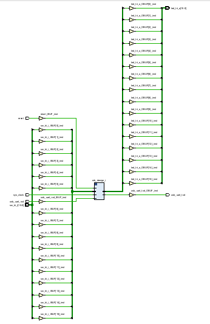
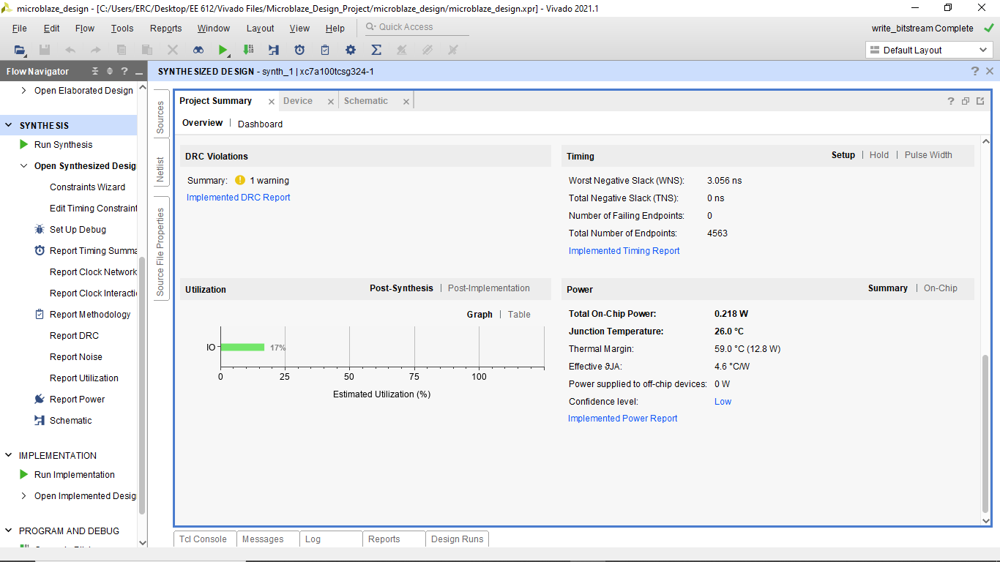
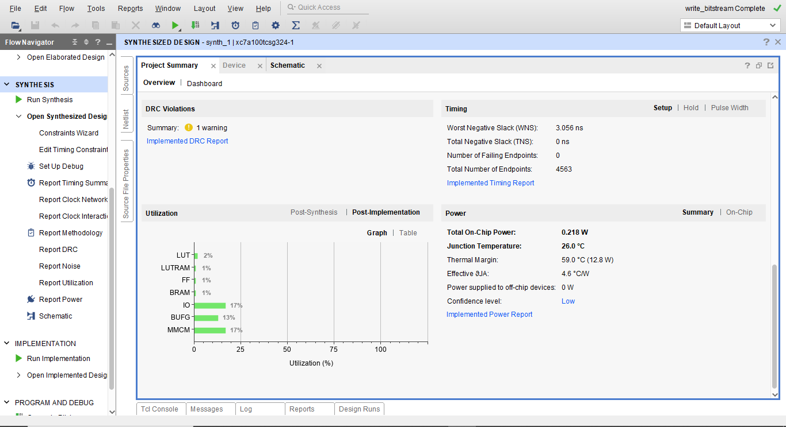
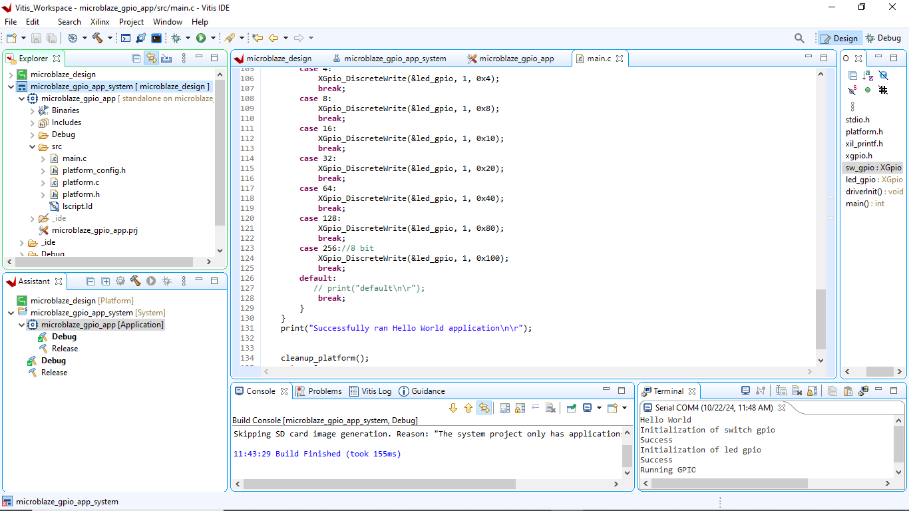

# MicroBlaze Embedded System (Nexys DDR)

Embedded FPGA system built with a Xilinx MicroBlaze soft-core processor on the Nexys DDR board.  
The design integrates UART, GPIO-controlled LEDs, and switch inputs, with C firmware developed in Vitis to map switch states directly to LEDs.

---

## Project Overview

This project implements a MicroBlaze-based embedded system on the Nexys DDR FPGA board.  
The objective was to build a hardware/software system in which slide switch inputs are read by the MicroBlaze processor and corresponding LED outputs are driven in real time.

The design includes:

- MicroBlaze soft-core processor
- UART interface for serial output
- GPIO input peripheral for board switches
- GPIO output peripheral for board LEDs

The firmware continuously reads switch values through memory-mapped GPIO and writes the corresponding values to the LED GPIO, enabling direct switch-to-LED hardware interaction.

---

## System Architecture

This system is built around a MicroBlaze soft processor implemented on the FPGA.

- MicroBlaze communicates with peripherals via the AXI bus
- Two AXI GPIO blocks are used:
  - Input GPIO (connected to slide switches)
  - Output GPIO (connected to LEDs)

The processor reads switch states as a bit vector and writes the same value to the LEDs, enabling real-time hardware interaction.

### What This Project Demonstrates

- Soft-core processor design using MicroBlaze
- AXI-based peripheral interfacing
- Memory-mapped I/O in embedded systems
- Real-time interaction between hardware inputs and outputs
- FPGA-based embedded system deployment

---

## Synthesized System Schematic



---

## Synthesis and Implementation Results

### Post-Synthesis Summary


### Post-Implementation Summary


---

## Firmware

The application was developed in Vitis using Xilinx GPIO drivers.

Main firmware behavior:

- Initialize switch GPIO as input
- Initialize LED GPIO as output
- Initialize platform and UART output
- Continuously read switch state
- Write corresponding value to LED GPIO

The firmware source is included in the `firmware/` directory.

---

### Core Control Logic

```c
while (1) {
    u32 sw_val = XGpio_DiscreteRead(&sw_gpio, 1);
    XGpio_DiscreteWrite(&led_gpio, 1, sw_val);
}
```

---

## Vitis Build / Runtime View



The console output confirms:

- platform startup
- successful GPIO initialization
- runtime execution of the GPIO control loop

---

## Hardware Validation

A hardware test was performed and the demonstration video is included in the `docs/` folder showing the physical slide switches on the FPGA board were toggled, and the corresponding LEDs responded immediately.

Verified hardware behavior:
- correct GPIO configuration
- correct AXI communication
- successful deployment on hardware

---

## Design Insight

The system uses memory-mapped I/O through AXI GPIO peripherals.  
Switch states are read as a bit vector from the input GPIO, and the same value is written to the LED GPIO output.

This approach demonstrates:

- hardware/software co-design using MicroBlaze
- AXI-based peripheral communication
- real-time interaction between FPGA I/O and embedded firmware

---

## Repository Structure

- `firmware/` – C firmware source files used in Vitis
- `docs/` – synthesis screenshots, implementation screenshots, runtime console image, and demonstration video

## Tools Used

- Xilinx Vivado
- Xilinx Vitis
- C
- MicroBlaze soft processor
- Nexys DDR FPGA board

---

## Project Structure

```text
.
├── docs/
├── firmware/
└── README.md
```

---

## Notes

This project was developed as part of FPGA and embedded systems coursework focused on hardware/software integration using a soft-core processor architecture.

---

## Author

Oluwaferanmi Arowoshola  
Electrical & Computer Engineering  
Minnesota State University, Mankato
