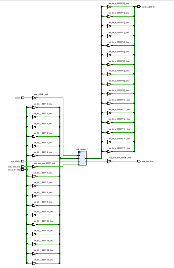
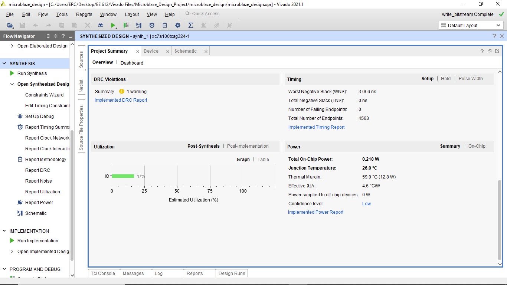
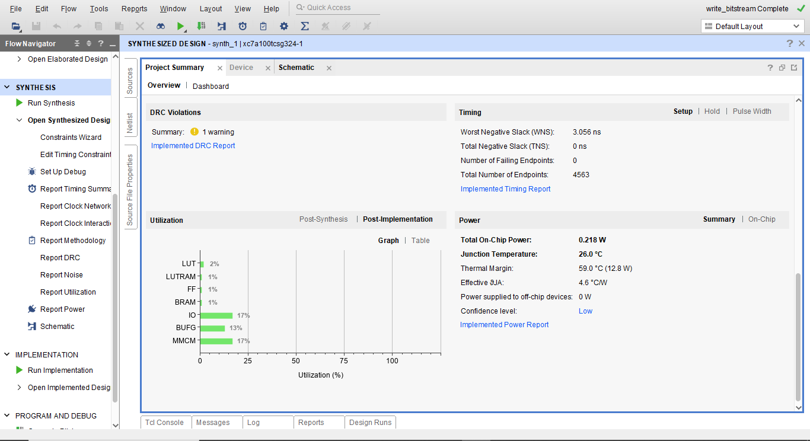
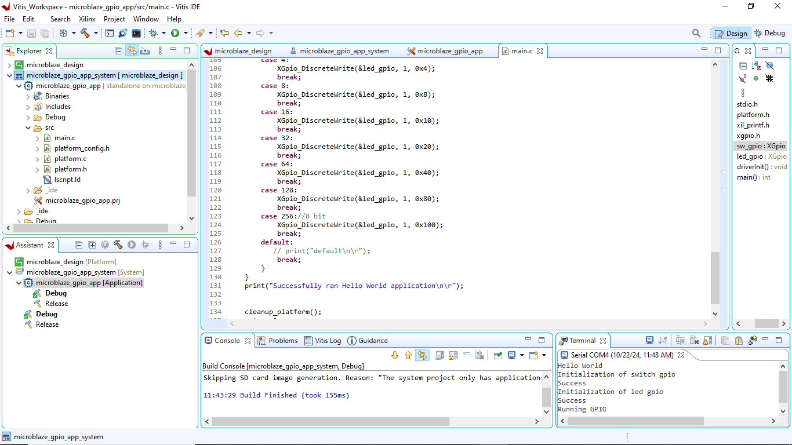

# MicroBlaze Embedded System (Nexys DDR)

**FPGA · MicroBlaze · Vivado · Vitis · AXI GPIO · UART · Embedded C · Memory-Mapped I/O · Hardware/Software Integration**

## Overview

This project implements a MicroBlaze-based embedded FPGA system on the **Nexys DDR FPGA board** using **Vivado** for hardware design and **Vitis** for C firmware development.

The system integrates a Xilinx MicroBlaze soft-core processor, AXI GPIO peripherals, UART output, and board-level switch/LED I/O to demonstrate memory-mapped hardware/software interaction on an FPGA platform.

The firmware continuously reads slide-switch values through an AXI GPIO input peripheral and writes the same bit pattern to an AXI GPIO output peripheral connected to the board LEDs. This creates a real-time switch-to-LED control system running through a soft-core embedded processor.

---

## What This Project Demonstrates

- FPGA-based embedded system design using a MicroBlaze soft-core processor
- Vivado hardware platform creation and peripheral integration
- AXI GPIO configuration for switch input and LED output
- C firmware development in Vitis using Xilinx GPIO drivers
- Memory-mapped I/O between firmware and FPGA peripherals
- UART/serial output for runtime visibility
- Bitstream generation and FPGA hardware deployment
- Board-level validation using physical switches and LEDs
- Hardware/software co-design using a soft processor architecture

---

## Quick Results

| Feature | Result |
|---|---|
| Target Board | Nexys DDR FPGA |
| Processor | Xilinx MicroBlaze soft-core processor |
| Hardware Tool | Vivado |
| Firmware Tool | Vitis |
| Firmware Language | C |
| Peripherals | AXI GPIO, UART |
| Inputs | Slide switches |
| Outputs | LEDs |
| Communication | Memory-mapped AXI peripheral access |
| Validation | Switch states successfully mapped to LED outputs on hardware |

---

## Project Overview

The objective of this project was to build a complete FPGA-based embedded system in which physical slide-switch inputs are read by a MicroBlaze processor and corresponding LED outputs are driven in real time.

The design includes:

- MicroBlaze soft-core processor
- AXI interconnect
- AXI GPIO input peripheral for slide switches
- AXI GPIO output peripheral for LEDs
- UART interface for serial/debug output
- C firmware application developed in Vitis
- Deployed FPGA hardware design running on the Nexys DDR board

The project demonstrates the relationship between hardware design in Vivado and firmware execution in Vitis.

---

## System Architecture

The system is built around a MicroBlaze soft processor implemented on the FPGA fabric.

```text
Slide Switches
      ↓
AXI GPIO Input Peripheral
      ↓
AXI Interconnect
      ↓
MicroBlaze Soft-Core Processor
      ↓
AXI Interconnect
      ↓
AXI GPIO Output Peripheral
      ↓
LEDs
```

The MicroBlaze processor reads switch states as a bit vector through the input GPIO peripheral and writes the same value to the LED GPIO output peripheral.

This demonstrates memory-mapped I/O, where firmware running on a soft-core processor controls FPGA-connected hardware peripherals through AXI bus transactions.

---

## Synthesized System Schematic



The system schematic shows the MicroBlaze processor and connected AXI peripherals used to support switch input, LED output, and serial/debug communication.

---

## Vivado Hardware Design

The hardware platform was created in **Xilinx Vivado**.

The Vivado design includes:

- MicroBlaze soft-core processor
- AXI interconnect
- AXI GPIO for slide-switch input
- AXI GPIO for LED output
- UART interface
- Clock and reset support
- Exported hardware platform for Vitis firmware development

The Vivado hardware design provides the memory-mapped peripheral structure that the C firmware accesses at runtime.

---

## Synthesis and Implementation Results

### Post-Synthesis Summary



### Post-Implementation Summary



The design was synthesized and implemented in Vivado before being exported for firmware development and hardware deployment.

---

## Vitis Firmware Design

The firmware was developed in **Vitis** using Xilinx GPIO driver APIs.

The firmware is responsible for:

- initializing the platform
- initializing GPIO peripherals
- configuring switch GPIO as input
- configuring LED GPIO as output
- reading switch states
- writing switch values to LEDs
- printing runtime/debug output through UART

The firmware source is included in the `firmware/` directory.

---

## Firmware Driver Functions

The project uses Xilinx GPIO driver functions such as:

- `XGpio_Initialize()`
- `XGpio_SetDataDirection()`
- `XGpio_DiscreteRead()`
- `XGpio_DiscreteWrite()`

These functions allow the firmware to interact with AXI GPIO peripherals mapped into the MicroBlaze address space.

---

## Core Control Logic

The main firmware loop continuously reads the switch GPIO input and writes the same value to the LED GPIO output.

```c
while (1) {
    u32 sw_val = XGpio_DiscreteRead(&sw_gpio, 1);
    XGpio_DiscreteWrite(&led_gpio, 1, sw_val);
}
```

This creates a direct hardware/software control path from physical FPGA board inputs to physical FPGA board outputs.

---

## Runtime / Vitis Console



The console output confirms:

- platform startup
- GPIO initialization
- runtime execution of the GPIO control loop

UART output provides visibility into the firmware execution state during deployment.

---

## Hardware Validation

The design was deployed to the Nexys DDR FPGA board and validated using the board’s physical slide switches and LEDs.

Validation steps:

1. Generate bitstream in Vivado.
2. Export hardware platform to Vitis.
3. Build the C firmware application.
4. Program the FPGA board.
5. Run the MicroBlaze application.
6. Toggle slide switches on the Nexys DDR board.
7. Confirm corresponding LED outputs update in real time.

Verified hardware behavior:

- GPIO input peripheral correctly reads switch states.
- GPIO output peripheral correctly drives LED states.
- MicroBlaze firmware successfully performs memory-mapped I/O.
- AXI communication between processor and peripherals works as expected.
- The system runs on physical FPGA hardware.

---

## Design Insight

The core design idea is memory-mapped I/O through AXI GPIO peripherals.

```text
Firmware Read  → AXI GPIO Switch Register
Firmware Write → AXI GPIO LED Register
```

Instead of hardwiring switches directly to LEDs in HDL, this project routes the interaction through a MicroBlaze processor. That makes the system a true hardware/software co-design example:

- FPGA hardware provides the processor and peripherals.
- C firmware controls the behavior.
- AXI enables communication between processor and GPIO hardware.
- Physical board I/O validates the full hardware/software path.

---

## Tools Used

- Xilinx Vivado
- Xilinx Vitis
- C programming language
- Xilinx MicroBlaze soft-core processor
- AXI GPIO peripherals
- UART serial output
- Nexys DDR FPGA board

---

## Project Structure

```text
.
├── docs/              # System schematic, Vivado/Vitis screenshots, and validation media
├── firmware/          # Vitis C firmware source
├── README.md          # Project documentation
└── LICENSE
```

---

## Limitations

- Current design maps switch inputs directly to LED outputs.
- GPIO polling is used instead of interrupt-driven input handling.
- The project focuses on AXI GPIO and UART integration rather than advanced peripherals.
- No external sensors or communication protocols beyond basic UART/GPIO are included.
- The system is intended as an FPGA embedded-system integration project, not a production firmware application.

---

## Future Improvements

Potential future improvements include:

- Add interrupt-driven GPIO input handling
- Add timer peripheral for periodic firmware tasks
- Add UART command interface for runtime control
- Add additional AXI peripherals such as SPI, PWM, or custom IP
- Add external sensor input through GPIO or SPI/I2C
- Add a structured validation checklist
- Add annotated Vivado block design documentation
- Expand firmware with multiple operating modes

---

## Key Takeaways

This project demonstrates a complete FPGA embedded-system workflow:

```text
Vivado Hardware Design → Bitstream Generation → Vitis Firmware Development → FPGA Deployment → Board-Level Validation
```

The project strengthened my experience with:

- FPGA-based embedded systems
- MicroBlaze soft-core processors
- AXI peripheral integration
- embedded C firmware
- memory-mapped I/O
- Vivado/Vitis workflow
- hardware/software integration
- physical board validation

---

## Notes

This project was developed as part of FPGA and embedded systems coursework focused on hardware/software integration using a soft-core processor architecture.

---

## Author

**Oluwaferanmi Arowoshola**  
M.S. Electrical & Computer Engineering  
Embedded Systems · FPGA · Firmware · Hardware/Software Integration · Digital Design

## License

This project is licensed under the MIT License.
